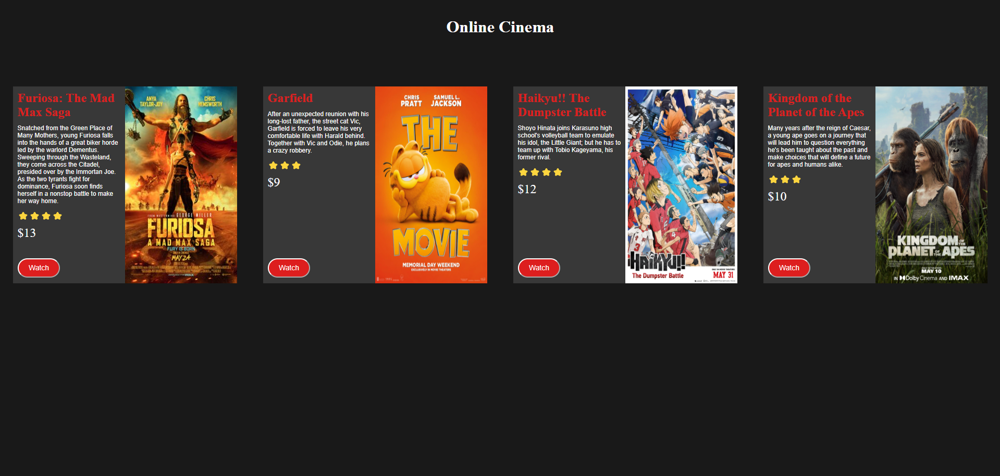

# 🎬 Cinema Web App

Welcome to the **Cinema Web App** repository! This project showcases a simple, interactive online cinema where users can browse movie listings, view details, and add movies to their watch list while tracking their total spending.

## 🔗 Live Demo

Try the [Cinema Web App](https://your-username.github.io/cinema-web-app/) now!

## 🚀 Features

- **Movie Listings**: Browse through a selection of movies with detailed descriptions, ratings, and prices.
- **Interactive UI**: Add movies to your watch list with a single click and see the total amount spent update in real time.
- **Responsive Design**: Adapted for various screen sizes for a seamless experience on both desktop and mobile devices.

## 🛠️ Technologies Used

- **HTML**: Structure and content.
- **CSS**: Styling and layout.
- **JavaScript**: Dynamic interaction and functionality.
